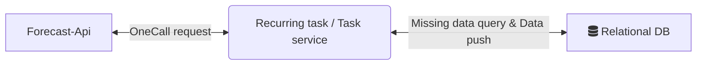
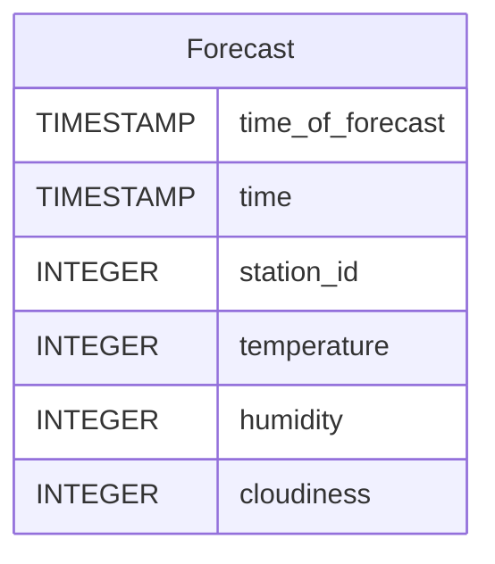
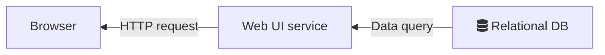
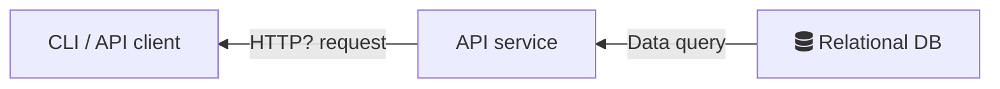
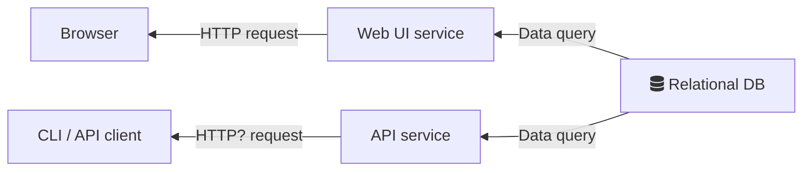
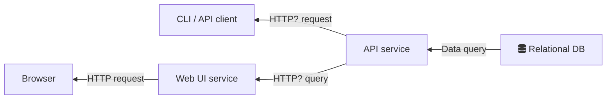
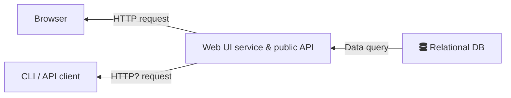

# Design of a solution to fetch, store and expose OpenWeatherMap data

We are going to design the simplest thing we can and we'll focus on the high level along with some interesting specific details.

I decided not to include a working POC because after trying to debug why my API key wasn't working, I realized that I'd have to provide payment information to get access to a free tier that allows usage of the OneCall endpoint.
That, combined with the fact that I'm not going to be able to deliver both containerized working apps, and ones adequately covered by tests in 2-4 hours (I don't know what engineer explores both a problems space and a new API and builds a working documented tested solution in just 2-4 hours) made me decide to just deliver this.

We can break down our design in two different parts of this service, the part that brings in data from the external source and handles storage, and the probably less important part which is an exploration web service. 

Let's cover the ingestion part:

## Ingestion

Sketching out what this would look like:

So we'd have to define a database schema for a table to hold the outlined pieces of information (forecast time, temperature, humidity, cloudiness), the location that this information concerns, along with the "photograph" time to use the terminology provided by the service we're querying.
A "photograph" time tells us the time where this forecast was constructed (so it's the moment in time where the forecast was based on the most recent information) - as opposed to the forecast time which tells us what time period this forecast is for.

Something like:

We'll go with an SQL database for general familiarity, nothing in our use case tells us we need anything beside this.
And we can drive most of our functionality from this single table - although depending on our access patterns for our data we might want to break this into more normalized tables.

Then let's talk about either our recurring task or our task service. This component will be responsible for actually continuously querying the forecast API, getting the data and pushing it to our DB.

Whether this is structured as a recurring job or a constantly running service depends basically on how often we want to populate data in the database. 
If we think we'll need to fetch data for a "photograph" of every second, then we'll probably be better served with a constantly running service.
If we think we want to fetch data every few minutes or every few hours, then we can go with a recurring job, scheduled in any sort of way (for example, if we're using k8s, as a k8s cronjob that runs continuously).

This piece of code (application or recurring script) will need to have the following pieces of configuration:
- API key, obviously
- Fetch interval in seconds, just what the time period between two stored observations should be.
- List of locations to fetch data for

We'd go with the list of locations as a setting to be passed to the application or recurring job to allow, if down the line we want to scale this process to second or even sub-second fetches for lots and lots of different locations, we can spin different services or jobs for different sets of locations so that these can run in parallel.

The logic for this application or recurring job would be minimal - when it's time to run again, and for each configured location:

- Check the last fetched time (by looking at the latest time_of_forecast stored in the table)
- Repeatedly fetch and store data from the api - fetch for last time_of_forecast + fetch interval at first, and then keep adding additional fetch interval offsets until your surpass now's timestamp.
- Sleep or die, until it's time to run again

What are the benefits of this design, as opposed to just having a process that runs once and fetches data for the current point in time? 
If for any reason we have a failure (our own code has a bug, our infrastructure is unstable, the external API is down or just intermittently responding) then we get automatic retries for free the next time we try to run this process.

We don't have to maintain any significant state to synchronize on, besides what's already being stored for our main purposes - which allows us to scale in the way mentioned earlier.

For convenience (avoiding hand written SQL queries) as well as achieving some separation of concerns, we could transform the data we have from the API into objects (that hold similar data to the outlined table rows) and use an ORM to write to and query the DB.

Let's move into how to display things some of this stuff we got onto our DB

## Data exploration UI

Since the main use of our data is, as outlined, for usage in modelling exploration, the way we expose our data should support both
- a UI that allows us visualize somehow the data that's there (if that's helpful at all, or even just to serve as a smoke test scenario for developers)
- a way for ML practitioners to fetch some data in an intuitive way to experiment with

The first point above is very broad, and it could range from must having a way to display some of the rows

The second point above could be useful to allow people to experiment easily at this very early phase of exploration - once this data is deemed useful we could find more efficient pipelines for the data to automatically be routed to something like a feature store to be more easily accessible to ML practitioners and their training pipelines.

We also have two options - have our service just expose a UI or also expose an API to get this information.

And depending on what we want we can go with a lot of different topologies in terms of services.

We can go with just a web service that displays provides a UI:

We can go with just an API:

We can go with both:

We can go with a web service that consumes also our public API (so we can dogfood our own API and make sure that we know of any pain points):

OR we can go with a single service that exposes both a web interface and a public API, which would be the simplest thing if we want to have both:

And it's most likely we'd start with the last one!

Now, what could this service expose in terms of UI? 
Maybe it's something as simple as taking in a date range and a location and displaying the rows that correspond to those.
Or maybe we would want to do something more elaborate, like graph out how predictions line up against actual observations.

One particular issue we might run into is that we might end up needing to support operations that take a long time to get through - like a report or a dump of a large part of our data.
This problem is quite interesting because it's likely to be handled as an async operation - ie. the client requests something that would take a while to generate, and the service will have to find a way to let them know that this is done.
And these kind of async operations are interesting to handle because they might require callbacks, or exposing endpoints to poll, and bring up some challenges in API design.
I've personally worked on systems that expose APIs using these semantics https://jsonapi.org/ and one interesting approach was representing requests for bundles of data as domain objects that hold a status and a relationship to the concrete bundle.
The client can then poll for the status of the request and then follow the relationship link to the resource that represents the actual bundle.

# Wrapping things up

Let's talk about what concrete technologies to use to get a quick POC going. 
Let's also suppose we are already deploying on kubernetes (as is very popular nowadays).

So we'd pick Django as our python web framework and the bundled Django ORM as our ORM. 
We'd build our web UI app as a Django application. We'd define the models and we'd get DB to application model mapping for "free" as well as some useful DB migration mechanisms to help us manage those concerns.
We'd deploy this app as we do the rest of our web apps, bundled as a container image and deployed through kubernetes as a pod.

Under the same django app, we'd add a custom management command (https://docs.djangoproject.com/en/4.2/howto/custom-management-commands/). 
This management command would re-use our DB models since it's got access to the same code as our Djagon web app does. And this command would use the forecast API client to pull the data as we described earlier.

We'd define a kubernetes cronjob (https://kubernetes.io/docs/concepts/workloads/controllers/cron-jobs/) that uses the same image as our web app but instead of the usual entrypoint, it instead provides a `command` that's using django's `manage.py` to run our django custom management command.

